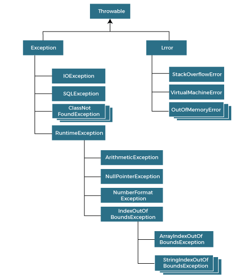

Iniciando o tutorial com o primeiro tópico abordado na ementa:

## Java Basics

### links alura
- [Java Basicos](https://unibb.alura.com.br/course/java-primeiros-passos)

## What is Java


1) Características do Java

- [Características do Java] (https://www.javatpoint.com/features-of-java)

Abaixo cabe destacar algumas das características da linguagem Java:

 - Programação orientada a objetos: Java é uma linguagem orientada a objetos.  Everything in Java is an object. Object-oriented means we organize our software as a combination of different types of objects that incorporate both data and behavior.
 - Plataforma Independente:  One of Java’s most significant advantages is its platform independence. Java programs are compiled into bytecode, which can run on any device equipped with a Java Virtual Machine (JVM). 
 - Secure: Java provides a secure environment for developing applications. It includes features like bytecode verification, secure class loading, and a security manager to protect against unauthorized access and threats
 - Robustez:  Java is known for its reliability. It has strong memory management, exception handling, and type checking mechanisms that help prevent errors and crashes. Java provides automatic garbage collection which runs on the Java Virtual Machine to get rid of objects which are not being used by a Java application anymore.


2) Aplicações do mundo real
- [Aplicações do Java no mundo real]()

text text text text text text text text text text text text text text text text text text text text text text text text text text text text text text text text text text text text text text text text text text text text text text text text

 - Enterprise Software Development
 - Android Application Development
 - Scientific and Data Analysis Applications
 - Internet of Things (IoT) Development
 - Financial Applications
 - E-commerce Platforms
 - Gaming
 - Educational Applications
 - Telecommunications
 - Cloud Computing
 
Java EE (Enterprise edition)

https://www.alura.com.br/apostila-java-web/o-que-e-java-ee?srsltid=AfmBOopwF-sN-6lSsxOiVjNtlQmgNMwDrb2_w2dzdTT-snwO8BZEe8l0


## Java Basics

### 1) JDK and JRE

<h4> Java Development Kit (JDK) </h4>

The JDK is a comprehensive suite of tools for Java developers. It includes everything needed to write, compile, and debug Java applications. Here are some key components:

- Java Compiler (javac): Converts Java source code into bytecode.
- Java Debugger (jdb): Helps in debugging Java programs.
- Java Runtime Environment (JRE): Included within the JDK, it allows you to run Java applications.
- Development Tools: Various tools for monitoring, profiling, and managing Java applications12.

<h4>Java Runtime Environment (JRE)</h4>
The JRE is a subset of the JDK and is focused solely on running Java applications. It includes:

- Java Virtual Machine (JVM): Executes Java bytecode.
- Core Libraries: Essential libraries required for running Java applications.
- Other Components: Such as Java Plug-in for running applets in browsers34.

In summary, the JDK is essential for Java development, providing tools for writing and testing code, while the JRE is necessary for running Java applications on your system.

### 2) Describe the components of object-oriented programming

#### Encapsulation

Encapsulation is the concept of wrapping data (variables) and methods (functions) that operate on the data into a single unit, known as a class. It helps in protecting the data from outside interference and misuse. In Java, encapsulation is achieved using access modifiers like private, protected, and public.

#### Inheritance

Inheritance allows a new class to inherit properties and behaviors (methods) from an existing class. The new class, called the subclass or derived class, can use and extend the features of the parent class. This promotes code reusability. In Java, inheritance is implemented using the extends keyword.

#### Polymorphism

Polymorphism means “many forms” and it allows one interface to be used for a general class of actions. The specific action is determined by the exact nature of the situation. In Java, polymorphism is mainly achieved through method overriding (runtime polymorphism) and method overloading (compile-time polymorphism).

#### Abstraction

Abstraction is the concept of hiding the complex implementation details and showing only the essential features of the object. It helps in reducing programming complexity and effort. In Java, abstraction is achieved using abstract classes and interfaces.

#### Exemplo

```Java

// Encapsulation
public class Car {
    private String model;
    private int year;

    public Car(String model, int year) {
        this.model = model;
        this.year = year;
    }

    public String getModel() {
        return model;
    }

    public int getYear() {
        return year;
    }
}

// Inheritance
public class ElectricCar extends Car {
    private int batteryLife;

    public ElectricCar(String model, int year, int batteryLife) {
        super(model, year);
        this.batteryLife = batteryLife;
    }

    public int getBatteryLife() {
        return batteryLife;
    }
}

// Polymorphism
public class Main {
    public static void main(String[] args) {
        Car myCar = new ElectricCar("Tesla", 2023, 500);
        System.out.println(myCar.getModel()); // Tesla
    }
}

// Abstraction
abstract class Animal {
    abstract void makeSound();
}

class Dog extends Animal {
    void makeSound() {
        System.out.println("Bark");
    }
}


```

### 3) Describe the components of a basic Java program

#### Package Declaration

If your class is part of a package, you declare it at the very beginning of your file. Packages help organize your classes and avoid naming conflicts.

```Java
package com.example.myapp;
```

https://refreshjava.com/java/packages-in-java

#### Import Statements

These are used to import other Java classes and packages that your class depends on. This allows you to use classes from the Java API or other libraries.

```Java
import java.util.Scanner;
```

#### Class Declaration

This is where you define your class. Every Java program must have at least one class definition. The class name should match the filename.

```Java
public class HelloWorld {
    // Class body
}
```
https://refreshjava.com/java/classes-in-java

#### Main Method

The main method is the entry point of any Java application. It’s where the program starts execution. The signature of the main method is always the same.
```Java
public static void main(String[] args) {
    // Code to be executed
}
```

#### Variables and Methods

Inside the class, you can declare variables and methods. Variables store data, and methods define the behavior of the class.

```Java
public class HelloWorld {
    // Variable declaration
    private String message;

    // Constructor
    public HelloWorld(String message) {
        this.message = message;
    }

    // Method
    public void printMessage() {
        System.out.println(message);
    }

    // Main method
    public static void main(String[] args) {
        HelloWorld hello = new HelloWorld("Hello, World!");
        hello.printMessage();
    }
}
```

https://refreshjava.com/java/structure-of-java-program


### 4) Compile and execute a Java program

#### Compile the Java program


Use the javac command to compile your Java file. This will generate a .class file.

```java
javac HelloWorld.java
```

Use the java command to run the compiled Java program.

```Java
java HelloWorld
```

## Basic Java Elements

### 1) Identify the conventions to be followed in a Java program

#### Packages

The prefix of a unique package name is always written in all-lowercase ASCII letters and should be one of the top-level domain names, currently com, edu, gov, mil, net, org, or one of the English two-letter codes identifying countries as specified in ISO Standard 3166, 1981.
Subsequent components of the package name vary according to an organization's own internal naming conventions. Such conventions might specify that certain directory name components be division, department, project, machine, or login names.

```Java 
com.sun.eng
com.apple.quicktime.v2
edu.cmu.cs.bovik.cheese
```

#### Classes

Class names should be nouns, in mixed case with the first letter of each internal word capitalized. Try to keep your class names simple and descriptive. Use whole words-avoid acronyms and abbreviations (unless the abbreviation is much more widely used than the long form, such as URL or HTML).	

```Java
class Raster;
class ImageSprite; 
```

#### Interfaces

Interface names should be capitalized like class names.	

```Java 
interface RasterDelegate;
interface Storing;
```

#### Methods

Methods should be verbs, in mixed case with the first letter lowercase, with the first letter of each internal word capitalized.

```Java 
run();
runFast();
getBackground();
```

#### Variables

Except for variables, all instance, class, and class constants are in mixed case with a lowercase first letter. Internal words start with capital letters. Variable names should not start with underscore _ or dollar sign $ characters, even though both are allowed.
Variable names should be short yet meaningful. The choice of a variable name should be mnemonic- that is, designed to indicate to the casual observer the intent of its use. One-character variable names should be avoided except for temporary "throwaway" variables. Common names for temporary variables are i, j, k, m, and n for integers; c, d, and e for characters.

```Java 
int             i;
char            c;
float           myWidth;
```

#### Constants

The names of variables declared class constants and of ANSI constants should be all uppercase with words separated by underscores ("_"). (ANSI constants should be avoided, for ease of debugging.)	

```Java 
static final int MIN_WIDTH = 4;
static final int MAX_WIDTH = 999;
static final int GET_THE_CPU = 1;
```

https://www.oracle.com/java/technologies/javase/codeconventions-introduction.html

### 2) Use Java reserved words


Keywords are reserved words in Java that serve as a code key. These words can't be used for anything else because they're predefined. They can't be used as a variable name, object name, or any other identifier. There are 51 reserved terms or keywords in Java.

```Java
abstract, assert, boolean, break, byte, case, catch, char, class, const,
continue, default, do, double, else, enum, extends, final, finally,
float, for, if, implements, import, instanceof, int, interface, long,
native, new, package, private, protected, public, return, short, static,
strictfp, super, switch, synchronized, this, throw, throws, transient, try, void, volatile, while
```

### 3) Use single-line and multi-line comments in Java programs

#### Single-Line Comments

Single-line comments in Java are used to comment out a single line or a part of it. They begin with two forward slashes (//) and extend to the end of the line. Single-line comments are helpful for brief explanations or notes relevant to the local code. 


```Java 
public class Main {
    public static void main(String[] args) {
        // Declare a variable to store the number
        int number = 10;

        // Calculate the square of the number
        int square = number * number;

        // Print the result
        System.out.println("The square of " + number + " is: " + square);
    }
}
```

#### Multi-Line Comments

Multi-line comments in Java are used to comment out blocks of text spanning multiple lines. They start with /* and end with */. Everything between these markers is considered a comment and is ignored by the Java compiler. Multi-line comments help provide detailed explanations or temporarily disable a block of code during debugging.

```Java 
public class Main {
    public static void main(String[] args) {
        int n = 10; // number of elements in the Fibonacci series

        /* The Fibonacci sequence is a series of numbers where
           a number is the addition of the last two numbers,
           starting with 0, and 1.

           This loop calculates each number in the series
           up to the nth number and prints them. */
        int n1 = 0, n2 = 1;
        System.out.print("First " + n + " terms: ");

        for (int i = 1; i <= n; ++i) {
            System.out.print(n1);

            if (i < n) {
                System.out.print(", ");
            }

            // compute the next term
            int sum = n1 + n2;
            n1 = n2;
            n2 = sum;
        }
    }
}
```

https://www.shiksha.com/online-courses/articles/java-comments/


### 4) Import other Java packages to make them accessible in your code

If you find a class you want to use, for example, the Scanner class, which is used to get user input, write the following code:

In the example above, java.util is a package, while Scanner is a class of the java.util package.

To use the Scanner class, create an object of the class and use any of the available methods found in the Scanner class documentation. In our example, we will use the nextLine() method, which is used to read a complete line:

```Java 
import java.util.Scanner;

class MyClass {
  public static void main(String[] args) {
    Scanner myObj = new Scanner(System.in);
    System.out.println("Enter username");

    String userName = myObj.nextLine();
    System.out.println("Username is: " + userName);
  }
}
```

There are many packages to choose from. In the previous example, we used the Scanner class from the java.util package. This package also contains date and time facilities, random-number generator and other utility classes.

To import a whole package, end the sentence with an asterisk sign (*). The following example will import ALL the classes in the java.util package:

```Java 
import java.util.*;
```

### 5) Describe the java.lang package

https://download.java.net/java/early_access/valhalla/docs/api/java.base/java/lang/package-summary.html

Provides classes that are fundamental to the design of the Java programming language. The most important classes are Object, which is the root of the class hierarchy, and Class, instances of which represent classes at run time.
Frequently it is necessary to represent a value of primitive type as if it were an object. The wrapper classes Boolean, Character, Integer, Long, Float, and Double serve this purpose. An object of type Double, for example, contains a field whose type is double, representing that value in such a way that a reference to it can be stored in a variable of reference type. These classes also provide a number of methods for converting among primitive values, as well as supporting such standard methods as equals and hashCode. The Void class is a non-instantiable class that holds a reference to a Class object representing the type void.

The class Math provides commonly used mathematical functions such as sine, cosine, and square root. The classes String, StringBuffer, and StringBuilder similarly provide commonly used operations on character strings.

Classes ClassLoader, Process, ProcessBuilder, Runtime, SecurityManager, and System provide "system operations" that manage the dynamic loading of classes, creation of external processes, host environment inquiries such as the time of day, and enforcement of security policies.

Class Throwable encompasses objects that may be thrown by the throw statement. Subclasses of Throwable represent errors and exceptions.

## Working with Java Data Types

### 1) Declare and initialize variables including a variable using final

https://www.baeldung.com/java-initialization

#### Declaration vs. Initialization

Declaration is the process of defining the variable, along with its type and name.

Initialization, on the other hand, is all about assigning a value to the variable.

```Java
//declaring a variable
int id;

//initializing a variable
id = 1;

//declaring and initializing a varible simultaneously
int num = 1
```

#### The Final Keyword

The final keyword applied to a field means that the field's value can no longer be changed after initialization. In this way, we can define constants in Java.

Let's add a constant to our User class:

```Java 
private static final int YEAR = 2000;
```
Constants must be initialized either when they're declared or in a constructor.

### 2) Cast a value from one data type to another including automatic and manual promotion

https://www.javatpoint.com/type-casting-in-java

In Java, type casting is a method or process that converts a data type into another data type in both ways manually and automatically. The automatic conversion is done by the compiler and manual conversion performed by the programmer. In this section, we will discuss type casting and its types with proper examples.


#### Widening Type Casting
Converting a lower data type into a higher one is called widening type casting. It is also known as implicit conversion or casting down. It is done automatically. It is safe because there is no chance to lose data. It takes place when:

- Both data types must be compatible with each other.
- The target type must be larger than the source type.

```Java 
public class WideningTypeCastingExample {  
    public static void main(String[] args) {  
        int x = 7;  
        //automatically converts the integer type into long type  
        long y = x;  
        //automatically converts the long type into float type  
        float z = y;  
        System.out.println("Before conversion, int value "+x);  
        System.out.println("After conversion, long value "+y);  
        System.out.println("After conversion, float value "+z);  
    }  
}  
```

Output

```
Before conversion, the value is: 7
After conversion, the long value is: 7
After conversion, the float value is: 7.0
```

#### Narrowing Type Casting
Converting a higher data type into a lower one is called narrowing type casting. It is also known as explicit conversion or casting up. It is done manually by the programmer. If we do not perform casting then the compiler reports a compile-time error.

```Java 
public class NarrowingTypeCastingExample {  
    public static void main(String args[]) {  
        double d = 166.66;  
        //converting double data type into long data type  
        long l = (long)d;  
        //converting long data type into int data type  
        int i = (int)l;  
        System.out.println("Before conversion: "+d);  
        //fractional part lost  
        System.out.println("After conversion into long type: "+l);  
        //fractional part lost  
        System.out.println("After conversion into int type: "+i);  
    }  
}  
```

Output
```
Before conversion: 166.66
After conversion into long type: 166
After conversion into int type: 166
```

### 3) Declare and initialize a String variable

https://www.baeldung.com/java-string-initialization
https://www.baeldung.com/java-string-pool

#### Creation 

We can use the new keyword or the literal syntax:

```java
String usingNew = new String("baeldung");
String usingLiteral = "baeldung";
```


#### String Declaration 

```java 
public class StringInitialization {

    String fieldString;

    void printDeclaredOnlyString() {
        String localVarString;
        
        // System.out.println(localVarString); -> compilation error
        System.out.println(fieldString);
    }
}
```
As we can see, if we try to use localVarString before giving it a value, we’ll get a compilation error. On the other hand, the console will show “null” for fieldString‘s value.

See, member variables are initialized with a default value when the class is constructed, null in String‘s case. But, we have to initialize local variables ourselves.

If we give localVarString a value of null, we’ll see that the two are, indeed, now equal:

#### String Initialization Using Literals

Let’s now create two Strings using the same literal:

```java
String literalOne = "Baeldung";
String literalTwo = "Baeldung";
assertTrue(literalOne == literalTwo);
```


The reason for this harks back to the fact that Strings are stored in a pool. literalOne adds the String “baeldung” to the pool, and literalTwo reuses it.

#### String Initialization Using new


We’ll see some different behavior, though, if we use the new keyword.

```java
String newStringOne = new String("Baeldung");
String newStringTwo = new String("Baeldung");

assertFalse(newStringOne == newStringTwo);
```

#### Empty Strings

```java
String emptyLiteral = "";
String emptyNewString = new String("");
String emptyNewStringTwo = new String();
```


As we know by now, the emptyLiteral will be added to the String pool, while the other two go directly onto the heap.

Although these won’t be the same objects, all of them will have the same value:

#### null Values 

Let’s declare and initialize a null String:

```java
String nullValue = null;
```

If we printed nullValue, we’d see the word “null”, as we previously saw. And, if we tried to invoke any methods on nullValue, we’d get a NullPointerException, as expected.


## Working with Java Operator

### 1) Use basic arithmetic operators to manipulate data including +, -, *, /, and %


### 2) Use the increment and decrement operators

https://www.javatpoint.com/increment-and-decrement-operators-questions-in-java

#### 2.1 Increment Operator (++):

The increment operator in Java is denoted by ++. It adds 1 to the current value of a variable. There are two ways to use the increment operator:


```java
int x = 5;  
x++;   // Equivalent to x = x + 1;  
```
or

```java
int x = 5;  
++x;   // Equivalent to x = x + 1;  
```

Both of these statements increase the value of x by 1. However, there is a subtle difference between the two when used as part of a larger expression, which we will explore later.

##### 2.1.1 Prefix Increment Operator:

When the increment operator is placed before the variable (++x), it increments the value of the variable before the value is used in the expression. For example:

```java
int a = 3;  
int b = ++a;  // Now, a is 4 and b is also 4  
```
In this case, a is incremented before its value is assigned to b.

##### 2.1.2 Postfix Increment Operator:

When the increment operator is placed after the variable (x++), it increments the value of the variable after its current value is used in the expression. For example:

```java
int c = 3;  
int d = c++;  // Now, c is 4, but d is 3  
```

Here, d is assigned the current value of c before c is incremented.


#### 2.2 Decrement Operator (--):

The decrement operator in Java is denoted by --. It subtracts 1 from the current value of a variable. Similar to the increment operator, there are two ways to use the decrement operator:

```java
int y = 8;  
y--;   // Equivalent to y = y - 1;  

int y = 8;  
--y;   // Equivalent to y = y - 1;`  
```
Both of these statements decrease the value of y by 1.

##### 2.2.1 Prefix Decrement Operator 

Similar to the increment operator, the prefix decrement operator (--x) decrements the value of the variable before its value is used in the expression.

```java
int m = 7;  
int n = --m;  // Now, m is 6 and n is also 6   
```

##### 2.2.2 Postfix Decrement Operator 

The postfix decrement operator (x--) decrements the value of the variable after its current value is used in the expression.

```java
int p = 7;  
int q = p--;  // Now, p is 6, but q is 7  
```

### 3. Relation Operator in Java 

https://www.digitalocean.com/community/tutorials/relational-operators-in-java

 - == is the equality operator. This returns true if both the operands are referring to the same object, otherwise false.
 - != is for non-equality operator. It returns true if both the operands are referring to the different objects, otherwise false.
 - < is less than operator.
 - \> is greater than operator.
 - <= is less than or equal to operator.
 - \>= is greater than or equal to operator.

#### 3.1 Relational Operators Supported Data Types

 - The == and != operators can be used with any primitive data types as well as objects.
 - The <, >, <=, and >= can be used with primitive data types that can be represented in numbers. It will work with char, byte, short, int, etc. but not with boolean. These operators are not supported for objects.

### 4. Use arithmetic assignment operators

https://www.geeksforgeeks.org/java-assignment-operator-with-examples/


### 5. Use conditional operators including &&, ||, and ? :

#### 5.1 Conditional AND

The operator is applied between two Boolean expressions. It is denoted by the two AND operators (&&). It returns true if and only if both expressions are true, else returns false.

#### 5.2 Conditional OR

The operator is applied between two Boolean expressions. It is denoted by the two OR operator (||). It returns true if any of the expression is true, else returns false.

#### 5.3 Ternary Operator

The meaning of ternary is composed of three parts. The ternary operator (? :) consists of three operands. It is used to evaluate Boolean expressions. The operator decides which value will be assigned to the variable. It is the only conditional operator that accepts three operands. It can be used instead of the if-else statement. It makes the code much more easy, readable, and shorter.

```
variable = (condition) ? expression1 : expression2  
```

The above statement states that if the condition returns true, expression1 gets executed, else the expression2 gets executed and the final result stored in a variable.

https://www.javatpoint.com/conditional-operator-in-java

### 6. Describe the operator precedence and use of parenthesis

https://www.refreshjava.com/java/operator-precedence#:~:text=What%20changes%20the%20precedence%20of,(a%2Bb)*c.

## Working with the String Class

### 1. Develop code that uses methods from the String class

https://www.javatpoint.com/methods-of-string-class

- **charAt(int index)**: retorna o caractere na posição especificada.

- **codePointAt(int index)**: retorna o valor Unicode do caractere na posição especificada.

- **compareTo(String anotherString)**: compara lexicograficamente duas strings.

- **compareToIgnoreCase(String str)**: compara lexicograficamente duas strings, ignorando diferenças entre maiúsculas e minúsculas.

- **concat(String str)**: concatena a string especificada ao final desta string.

- **contains(CharSequence s)**: verifica se a string contém a sequência de caracteres especificada.

- **contentEquals(CharSequence cs)**: compara a sequência de caracteres especificada com esta string.

- **endsWith(String suffix)**: verifica se a string termina com o sufixo especificado.

- **equals(Object anObject)**: compara se esta string é igual ao objeto especificado.

- **equalsIgnoreCase(String anotherString)**: compara se esta string é igual a outra string, ignorando diferenças entre maiúsculas e minúsculas.

- **format(String format, Object... args)**: retorna uma string formatada usando a string de formato e argumentos especificados.

- **indexOf(int ch)**: retorna o índice da primeira ocorrência do caractere especificado.

- **isEmpty()**: verifica se a string está vazia.

- **lastIndexOf(int ch)**: retorna o índice da última ocorrência do caractere especificado.

- **length()**: retorna o comprimento da string.

- **replace(char oldChar, char newChar)**: substitui todas as ocorrências de um caractere especificado por um novo caractere.

- **split(String regex)**: divide a string em uma matriz de substrings em torno das correspondências da expressão regular especificada.

- **startsWith(String prefix)**: verifica se a string começa com o prefixo especificado.

- **substring(int beginIndex, int endIndex)**: retorna uma substring especificada pelos índices de início e fim.

- **toLowerCase()**: converte todos os caracteres em minúsculas usando as regras da localidade padrão.

- **toUpperCase()**: converte todos os caracteres em maiúsculas usando as regras da localidade padrão.

- **trim()**: remove espaços em branco de ambos os lados da string.

### 2. Format Strings using escape sequences including %d, %n, and %s

https://www.geeksforgeeks.org/format-specifiers-in-java/

Format specifiers begin with a percent character (%) and terminate with a “type character, ” which indicates the type of data (int, float, etc.) that will be converted the basic manner in which the data will be represented (decimal, hexadecimal, etc.) The general syntax of a format specifier is

```
% [flags] [width] [.precision] [argsize] typechar
```

The format() method of Formatter class accepts a wide variety of format specifiers. When an uppercase specifier is used, then letters are shown in uppercase. Otherwise, the upper- and lowercase specifiers perform the same conversion. 

| Format specifier |      Conversion applied     |
|:----------------:|:---------------------------:|
|        %d        |       Decimal integer       |
|        %n        | Insert a new line character |
|        %s        |            String           |

## Working with the Random and Math Classes

### 1. Use the Random class 

https://www.geeksforgeeks.org/java-util-random-class-java/
https://www.scaler.com/topics/random-class-in-java/

Random class is used to generate pseudo-random numbers in java. An instance of this class is thread-safe. The instance of this class is however cryptographically insecure. This class provides various method calls to generate different random data types such as float, double, int.

| Método | Descrição |
|---|---|
| `nextBoolean()` | Retorna o próximo valor booleano pseudoaleatório. |
| `nextDouble()` | Retorna o próximo valor double pseudoaleatório. |
| `nextFloat()` | Retorna o próximo valor float pseudoaleatório. |
| `nextGaussian()` | Retorna o próximo valor double pseudoaleatório distribuído de acordo com uma distribuição normal (Gaussiana). |
| `nextInt()` | Retorna o próximo valor int pseudoaleatório. |
| `nextInt(int bound)` | Retorna um valor int pseudoaleatório entre 0 (inclusivo) e o valor especificado (exclusivo). |
| `nextLong()` | Retorna o próximo valor long pseudoaleatório. |
| `setSeed(long seed)` | Define o valor da semente para este gerador de números aleatórios. |
| `nextBytes(byte[] bytes)` | Gera bytes aleatórios e os coloca no array fornecido. |
| `ints()` | Retorna um stream infinito de inteiros pseudoaleatórios. |
| `ints(long streamSize)` | Retorna um stream de inteiros pseudoaleatórios com o tamanho especificado. |
| `ints(int randomNumberOrigin, int randomNumberBound)` | Retorna um stream infinito de inteiros pseudoaleatórios dentro do intervalo especificado. |
| `ints(long streamSize, int randomNumberOrigin, int randomNumberBound)` | Retorna um stream de inteiros pseudoaleatórios com o tamanho especificado dentro do intervalo especificado. |
| `longs()` | Retorna um stream infinito de longos pseudoaleatórios. |
| `longs(long streamSize)` | Retorna um stream de longos pseudoaleatórios com o tamanho especificado. |
| `longs(long randomNumberOrigin, long randomNumberBound)` | Retorna um stream infinito de longos pseudoaleatórios dentro do intervalo especificado. |
| `longs(long streamSize, long randomNumberOrigin, long randomNumberBound)` | Retorna um stream de longos pseudoaleatórios com o tamanho especificado dentro do intervalo especificado. |
| `doubles()` | Retorna um stream infinito de doubles pseudoaleatórios. |
| `doubles(long streamSize)` | Retorna um stream de doubles pseudoaleatórios com o tamanho especificado. |
| `doubles(double randomNumberOrigin, double randomNumberBound)` | Retorna um stream infinito de doubles pseudoaleatórios dentro do intervalo especificado. |
| `doubles(long streamSize, double randomNumberOrigin, double randomNumberBound)` | Retorna um stream de doubles pseudoaleatórios com o tamanho especificado dentro do intervalo especificado. |

### 2. Use the Math class 

The Java Math class has many methods that allows you to perform mathematical tasks on numbers.

| Método | Descrição |
|---|---|
| `abs(double a)` | Retorna o valor absoluto de um valor. |
| `acos(double a)` | Retorna o arco-cosseno de um valor. |
| `asin(double a)` | Retorna o arco-seno de um valor. |
| `atan(double a)` | Retorna o arco-tangente de um valor. |
| `cbrt(double a)` | Retorna a raiz cúbica de um valor. |
| `ceil(double a)` | Retorna o menor valor inteiro maior ou igual ao argumento. |
| `cos(double a)` | Retorna o cosseno de um ângulo. |
| `exp(double a)` | Retorna a constante de Euler elevada à potência do argumento. |
| `floor(double a)` | Retorna o maior valor inteiro menor ou igual ao argumento. |
| `log(double a)` | Retorna o logaritmo natural (base e) de um valor. |
| `log10(double a)` | Retorna o logaritmo de base 10 de um valor. |
| `max(double a, double b)` | Retorna o maior de dois valores. |
| `min(double a, double b)` | Retorna o menor de dois valores. |
| `pow(double a, double b)` | Retorna o valor de a elevado à potência de b. |
| `random()` | Retorna um valor double positivo maior ou igual a 0.0 e menor que 1.0. |
| `round(double a)` | Retorna o valor arredondado de um valor. |
| `sin(double a)` | Retorna o seno de um ângulo. |
| `sqrt(double a)` | Retorna a raiz quadrada de um valor. |
| `tan(double a)` | Retorna a tangente de um ângulo. |


## Using Decision Statements

### 1. Use the decision making statement  (if-then and if-then-else)

#### 1.1 If Statement in Java 

The “if” statement in Java is like a traffic signal that helps your program make decisions. It allows you to run a specific piece of code only if a particular condition is met. It’s like saying, “If something is true, then do this!”

```java 
if(condition){
//code to be executed
}
```

```java 
public class IfStatementExample {
    public static void main(String[] args) {

        int age = 18;
       
        if (age >= 18) {
            System.out.println("You are eligible to vote!");
        }
    }
}
```

#### 1.2 If-Else Statement in Java

Now you may be wondering what if the condition is not true and you want to execute some another block of code. The “if-else” statement in Java is another decision-making statement that allows you to execute different blocks of code based on the condition’s result. It provides an alternative path to take when the condition is not true.

```java 
if(condition){
//code to be executed if the condition is true
} else{
//code to be executed if the condition is false
}
```
Here’s a simple example to illustrate the usage of the “if-else” statement:

```java
public class IfElseStatementExample {
    public static void main(String[] args) {
        int age = 16;
       
        if (age >= 18) {
            System.out.println("You are eligible to vote!");
        } else {
            System.out.println("You are not eligible to vote yet.");
        }
    }
}
```

### 2. Use the switch statement 

Java’s “switch” statement is a decision-making statement that lets you choose which of numerous code blocks to run depending on the value of a certain variable. It offers a practical method for handling various alternatives or scenarios in your code.

```java 
switch(expression)
{
case <value1>:
//code to be executed
break;
case <value2>:
//code to be executed
break;
default:
//code to be defaultly executed
}
```

Imagine you are in a coffee shop and want to order a beverage. You approach the counter, and the barista asks for your order. Instead of using a series of “if” statements to check each possible option, the barista uses a switch statement.

The barista takes your order and checks the value you provide. Based on that value, they can quickly determine which beverage you want and prepare it accordingly. Each possible value represents a different option, such as “coffee,” “tea,” “cappuccino,” or “latte.” The barista can efficiently handle all these options using a switch statement.

Here’s a simple example code that demonstrates the use of the switch statement:

```java 
public class BeverageExample {
    public static void main(String[] args) {
        String beverage = "cappuccino";
        switch (beverage) {
            case "coffee":
                System.out.println("Enjoy your hot coffee!");
                break;
            case "tea":
                System.out.println("Savor the flavor of your tea!");
                break;
            case "cappuccino":
                System.out.println("Indulge in the creamy cappuccino!");
                break;
            default:
                System.out.println("Sorry, we don't have that beverage.");
        }
    }
}
```

#### The break keyword 

When Java reaches a break keyword, it breaks out of the switch block.
This will stop the execution of more code and case testing inside the block.
When a match is found, and the job is done, it's time for a break. There is no need for more testing.
A break can save a lot of execution time because it "ignores" the execution of all the rest of the code in the switch block.

#### The default Keyword

The default keyword specifies some code to run if there is no case match. Note that if the default statement is used as the last statement in a switch block, it does not need a break.


### 3. Compare how == differs between primitives and objects 

Both the equals() method and the == operator are used to compare two objects in Java.

The Java string equals() method, compares two strings and returns true if all characters match in both strings, else returns false.

The == operator compares the reference or memory location of objects in a heap, whether they point to the same location or not.
Whenever we create an object using the operator new, it will create a new memory location for that object. So we use the == operator to check memory location or address of two objects are the same or not.

In general, both equals() and “==” operators in Java are used to compare objects to check equality, but here are some of the differences between the two: 

1. The main difference between the .equals() method and the == operator is that one is a method, and the other is the operator.
2. We can use == operators for reference comparison (address comparison) and .equals() method for content comparison. In simple words, == checks if both objects point to the same memory location whereas .equals() evaluates to the comparison of values in the objects.
3. If a class does not override the equals method, then by default, it uses the equals(Object o) method of the closest parent class that has overridden this method. **See Why to Override equals(Object) and hashCode() method? in detail.

We can apply equality operators for every primitive type, including the boolean type. We can also apply equality operators for object types. 

If we apply == for object types then, there should be compatibility between argument types (either child to parent or parent to child or same type). Otherwise, we will get a compile-time error. 

### 4. Compare two String objects by using the compareTo and equals methods

In String Context:
- compareTo: Compares two strings lexicographically.
- equals: Compares this string to the specified object.

compareTo compares two strings by their characters (at same index) and returns an integer (positive or negative) accordingly.


```java
String s1 = "ab";
String s2 = "ab";
String s3 = "qb";
s1.compareTo(s2); // is 0
s1.compareTo(s3); // is -16
s3.compareTo(s1); // is 16
```

## Using Looping Statements

## Debugging and Exception Handling

### 1. Identify syntax and logic errors

https://www.geeksforgeeks.org/types-of-errors-in-java-with-examples/

https://www.shiksha.com/online-courses/articles/difference-between-errors-and-exceptions-in-java-blogId-155937#:~:text=In%20Java%2C%20errors%20occur%20at,handled%20using%20try%2Dcatch%20blocks.

#### 1.1 Run Time Error

Run Time errors occur or we can say, are detected during the execution of the program. Sometimes these are discovered when the user enters an invalid data or data which is not relevant. Runtime errors occur when a program does not contain any syntax errors but asks the computer to do something that the computer is unable to reliably do. During compilation, the compiler has no technique to detect these kinds of errors. It is the JVM (Java Virtual Machine) that detects it while the program is running. To handle the error during the run time we can put our error code inside the try block and catch the error inside the catch block. 

#### 1.2 Compile Time Error

Compile Time Errors are those errors which prevent the code from running because of an incorrect syntax such as a missing semicolon at the end of a statement or a missing bracket, class not found, etc. These errors are detected by the java compiler and an error message is displayed on the screen while compiling. Compile Time Errors are sometimes also referred to as Syntax errors. These kind of errors are easy to spot and rectify because the java compiler finds them for you. The compiler will tell you which piece of code in the program got in trouble and its best guess as to what you did wrong. Usually, the compiler indicates the exact line where the error is, or sometimes the line just before it, however, if the problem is with incorrectly nested braces, the actual error may be at the beginning of the block. In effect, syntax errors represent grammatical errors in the use of the programming language. 

#### 1.3 Logical Error

Logical Error: A logic error is when your program compiles and executes, but does the wrong thing or returns an incorrect result or no output when it should be returning an output. These errors are detected neither by the compiler nor by JVM. The Java system has no idea what your program is supposed to do, so it provides no additional information to help you find the error. Logical errors are also called Semantic Errors. 

### 2. Use exception handling

https://www.javatpoint.com/exception-handling-in-java

In Java, an exception is an event that occurs during the execution of a program that disrupts the normal flow of instructions. These exceptions can occur for various reasons, such as invalid user input, file not found, or division by zero. When an exception occurs, it is typically represented by an object of a subclass of the java.lang.Exception class.

#### 2.1 Hierarchy of Java Exception classes



#### 2.2 Types of Java Exceptions

##### 2.2.1 Checked Exceptions

Checked exceptions are the exceptions that are checked at compile-time. This means that the compiler verifies that the code handles these exceptions either by catching them or declaring them in the method signature using the throws keyword. 

**IOException**: An exception is thrown when an input/output operation fails, such as when reading from or writing to a file.

**SQLException**: It is thrown when an error occurs while accessing a database.

**ParseException**: Indicates a problem while parsing a string into another data type, such as parsing a date.

**ClassNotFoundException**: It is thrown when an application tries to load a class through its string name using methods like Class.forName(), but the class with the specified name cannot be found in the classpath.

##### 2.2.2 Unchecked Exceptions

Unchecked exceptions, also known as runtime exceptions, are not checked at compile-time. These exceptions usually occur due to programming errors, such as logic errors or incorrect assumptions in the code. They do not need to be declared in the method signature using the throws keyword, making it optional to handle them. Examples of unchecked exceptions include:

**NullPointerException**: It is thrown when trying to access or call a method on an object reference that is null.

**ArrayIndexOutOfBoundsException**: It occurs when we try to access an array element with an invalid index.

**ArithmeticException**: It is thrown when an arithmetic operation fails, such as division by zero.

**IllegalArgumentException**: It indicates that a method has been passed an illegal or inappropriate argument.

#### 2.3 Difference between Checked and Unchecked Exceptions

##### 2.3.1 Checked Exceptions

**Compile-time Check**: Checked exceptions are checked at compile-time by the Java compiler. This means that the compiler ensures that these exceptions are either caught or declared in the method signature using the throws keyword.

**Examples**: Examples of checked exceptions include IOException, SQLException, ParseException, etc.

**Forced Handling**: Checked exceptions enforce explicit handling, either by catching them or declaring them to be thrown. This helps in improving code reliability and robustness.

**Recovery Possible**: Checked exceptions typically represent recoverable conditions, such as file not found or database connection failure, where the application may take corrective action.

##### 2.3.2 Unchecked Exceptions

**Not Checked at Compile-time**: Unlike checked exceptions, unchecked exceptions are not checked at compile-time. This means that the compiler does not enforce handling of unchecked exceptions.

**Examples**: Examples of unchecked exceptions include NullPointerException, ArrayIndexOutOfBoundsException, ArithmeticException, etc.

**Runtime Errors**: Unchecked exceptions often represent programming errors or unexpected conditions during runtime, such as null references or array index out of bounds.

**Optional Handling**: Handling of unchecked exceptions is optional. While it's good practice to handle them for robustness, it's not mandatory.

### 3. Handle common exceptions thrown

https://www.baeldung.com/java-exceptions

https://pt.stackoverflow.com/questions/17025/usando-as-palavras-chave-throws-e-throw


#### 3.1 Checked Exception

throws faz parte da declaração do método, da sua assinatura. Ele define parte da API. Indica que um trecho de código que chame este método deve obrigatoriamente capturar uma possível exceção que ele lance. Mesmo que não deseje fazer nada com a exceção, ela deve ser capturada e relançada. Ou deve indicar que o método que usa outro com uma exceção possível tem um throw, como abaixo:

```java 
public void M1() throws IOException {
    FileReader f = new FileReader("notExist.txt");
}
```
Neste caso, qualquer método que chame M1() deve obrigatoriamente tratar a exceção IOException com um try ou indicar que ele lança a mesma exceção especificada em M1().

Pode parecer que não há nenhuma exceção neste método, mas o FileReader lança uma exceção FileNotFoundException que é derivada do IOException. A assinatura do método construtor FileReader exige um tratamento dela. A inclusão do throws IOException() na assinatura do método garante o tratamento delegando para o chamador de M1() tratar adequadamente.

#### 3.2 Lançar uma exceção

throw é um statement, ele manda a exceção ser lançada.

```java 
public void M2() {
    throw new IOException();
}
```
Este método lança uma exceção mas não exige que ela seja tratada por seus chamadores. Ele transfere o controle do fluxo para os métodos chamadores. Ele usa o que se chama unckecked exception, ou seja, uma exceção é lançada mas nada obriga ela ser tratada. É tratado em tempo de execução.

### 4. Use try and catch blocks

https://www.w3schools.com/java/java_try_catch.asp

The try statement allows you to define a block of code to be tested for errors while it is being executed.

The catch statement allows you to define a block of code to be executed, if an error occurs in the try block.

The try and catch keywords come in pairs:

```java 
try {
  //  Block of code to try
}
catch(Exception e) {
  //  Block of code to handle errors
}
```

Consider the following example:


This will generate an error, because myNumbers[10] does not exist.
```java 
public class Main {
  public static void main(String[ ] args) {
    int[] myNumbers = {1, 2, 3};
    System.out.println(myNumbers[10]); // error!
  }
}
```

The output will be something like this:

``` 
Exception in thread "main" java.lang.ArrayIndexOutOfBoundsException: 10
        at Main.main(Main.java:4)
```

If an error occurs, we can use try...catch to catch the error and execute some code to handle it:

```java 
public class Main {
  public static void main(String[ ] args) {
    try {
      int[] myNumbers = {1, 2, 3};
      System.out.println(myNumbers[10]);
    } catch (Exception e) {
      System.out.println("Something went wrong.");
    }
  }
}
```


## Arrays and ArrayLists

### 1. Use a one-dimensional array 

An array is a type of Data Structure that can store collections of elements. These elements are stored in contiguous memory locations and the it provides efficient access to each element based on the index of the array element.

#### 1.1 Formas de declarar um array 

https://sentry.io/answers/how-do-i-declare-and-initialize-an-array-in-java/

The easiest way to declare and initialize an array of a primitive type such as int in Java is by using the following syntax.

```java 
int[] myArray = new int[]{1, 2, 3};
```

This does a few things at once.

- The int[] myArray says that we want to declare a new variable called myArray that has the type of an array of integers.
- new int[] says we want to immediately allocate memory to store data in this array.
- {1,2,3} is the data we want to store in the array. Java will count the elements in our initial array and automatically initialize the array with enough memory for three ints.

If you don’t want to hard code the data immediately when you initialize the array, you can instead create an empty array (with all values initialized to zero) as follows.

```java 
int[] myArray = new int[3];
```

### 1.2 Outros tipos de array 

You can use the same syntax to create arrays to store other objects. In the example below, we use Integer instead of int, which is very similar to the above code but initializes the default values to null instead of 0.

```java 
class Main {

    public static void main(String[] args) {

        // declare the variable and allocate memory
        Integer[] myArray = new Integer[3];
        myArray[1] = 100;
        for (int i = 0; i < 3; i++) {
            System.out.println(myArray[i]);
        }
    }
}
```

O output será:

```java 
null
100
null
```

https://www.geeksforgeeks.org/default-values-assigned-to-primitive-data-types-in-java/

### 2. Create and manipulate an ArrayList 

Java ArrayList is a part of the Java collections framework and it is a class of java.util package. It provides us with dynamic arrays in Java. Though, it may be slower than standard arrays but can be helpful in programs where lots of manipulation in the array is needed. This class is found in java.util package. The main advantage of ArrayList in Java is, that if we declare an array then we need to mention the size, but in ArrayList, it is not needed to mention the size of ArrayList. If you want to mention the size then you can do it.

Let’s create an ArrayList object named elements which stores string elements:

```java 
import java.util.ArrayList;    // Importing the ArrayList class from the java.util package

// Creating an ArrayList to store String elements 
ArrayList<String> elements = new ArrayList<String>();
```

#### 2.1 Important Features of ArrayList in Java

- ArrayList inherits AbstractList class and implements the List interface.
- ArrayList is initialized by size. However, the size is increased automatically if the collection grows or shrinks if the objects are removed from the collection.
- Java ArrayList allows us to randomly access the list.
- ArrayList can not be used for primitive types, like int, char, etc. We need a wrapper class for such cases.
- ArrayList in Java can be seen as a vector in C++.
- ArrayList is not Synchronized. Its equivalent synchronized class in Java is Vector.

#### 2.2 Métodos de um ArrayList

https://www.geeksforgeeks.org/arraylist-in-java/

| Método | Descrição |
|---|---|
| `add(int index, Object element)` | Este método é usado para inserir um elemento específico em uma posição específica index em uma lista. |
| `add(Object o)` | Este método é usado para adicionar um elemento específico ao final de uma lista. |
| `addAll(Collection C)` | Este método é usado para adicionar todos os elementos de uma coleção específica ao final da lista mencionada, na ordem em que os valores são retornados pelo iterador da coleção especificada. |
| `addAll(int index, Collection C)` | Usado para inserir todos os elementos a partir da posição especificada de uma coleção específica na lista mencionada. |
| `clear()` | Este método é usado para remover todos os elementos de qualquer lista. |
| `clone()` | Este método é usado para retornar uma cópia superficial de um ArrayList em Java. |
| `contains(Object o)` | Retorna verdadeiro se esta lista contiver o elemento especificado. |
| `ensureCapacity(int minCapacity)` | Aumenta a capacidade desta instância de ArrayList, se necessário, para garantir que ela possa conter pelo menos o número de elementos especificados pelo argumento de capacidade mínima. |
| `forEach(Consumer<? super E> action)` | Executa a ação dada para cada elemento do Iterable até que todos os elementos tenham sido processados ou a ação lance uma exceção. |
| `get(int index)` | Retorna o elemento na posição especificada nesta lista. |
| `indexOf(Object O)` | O índice da primeira ocorrência de um elemento específico é retornado ou -1 caso o elemento não esteja na lista. |
| `isEmpty()` | Retorna verdadeiro se esta lista não contiver elementos. |
| `lastIndexOf(Object O)` | O índice da última ocorrência de um elemento específico é retornado ou -1 caso o elemento não esteja na lista. |
| `listIterator()` | Retorna um iterador de lista sobre os elementos nesta lista (na sequência apropriada). |
| `listIterator(int index)` | Retorna um iterador de lista sobre os elementos nesta lista (na sequência apropriada), começando na posição especificada na lista. |
| `remove(int index)` | Remove o elemento na posição especificada nesta lista. |
| `remove(Object o)` | Remove a primeira ocorrência do elemento especificado desta lista, se estiver presente. |
| `removeAll(Collection c)` | Remove desta lista todos os seus elementos que estão contidos na coleção especificada. |
| `removeIf(Predicate filter)` | Remove todos os elementos desta coleção que satisfaçam o predicado dado. |
| `removeRange(int fromIndex, int toIndex)` | Remove desta lista todos os elementos cujo índice está entre fromIndex, inclusive, e toIndex, exclusivo. |
| `retainAll(Collection<?> c)` | Retém apenas os elementos nesta lista que estão contidos na coleção especificada. |
| `set(int index, E element)` | Substitui o elemento na posição especificada nesta lista pelo elemento especificado. |
| `size()` | Retorna o número de elementos nesta lista. |
| `spliterator()` | Cria um Spliterator de ligação tardia e fail-fast sobre os elementos nesta lista. |
| `subList(int fromIndex, int toIndex)` | Retorna uma visão da parte desta lista entre o fromIndex especificado, inclusive, e toIndex, exclusivo. |
| `toArray()` | Este método é usado para retornar um array contendo todos os elementos na lista na ordem correta. |
| `toArray(Object[] O)` | Também é usado para retornar um array contendo todos os elementos nesta lista na ordem correta, assim como o método anterior. |
| `trimToSize()` | Este método é usado para ajustar a capacidade da instância do ArrayList ao tamanho atual da lista. |


### 3. Traverse the elements of an ArrayList by using iterators and loops including the enhanced for loop 


#### 3.1 Usando Iterators 


https://www.w3schools.com/java/java_iterator.asp

```java 
// Java program to iterate over an ArrayList
// Using Iterator

// Importing all utility classes
import java.util.*;

// Main class
class GFG {

    // Main driver method
    public static void main(String[] args)
    {
        // Declaring and initializing ArrayList
        List<Integer> numbers
            = Arrays.asList(1, 2, 3, 4, 5, 6, 7, 8);

        // Iterating ArrayList using Iterator
        Iterator it = numbers.iterator();

        // Holds true till there is single element
        // remaining in the list
        while (it.hasNext())

            // Print the elements of ArrayList
            System.out.print(it.next() + " ");
    }
}
```

#### 3.2 Usando Loops 

```java 
// Java  program to iterate over an ArrayList
// Using for loop

// Importing all utility classes 
import java.util.*;

// Main class 
class GFG {
  
    // Main driver method  
    public static void main(String[] args)
    {
        // Creating and initializing the ArrayList
        // Declaring object of integer type 
        List<Integer> numbers = Arrays.asList(1, 2, 3,
                                       4, 5, 6, 7, 8);

        // Iterating using for loop
        for (int i = 0; i < numbers.size(); i++) 
          
            // Printing and display the elements in ArrayList 
            System.out.print(numbers.get(i) + " ");        
    }
}
```


#### 3.3 Usando enhanced loop

```java 
// Java program to iterate over an arraylist
// using Iterator in Java8 with Lambda Expression 

// Importing all utility classes 
import java.util.*;

// Main class 
class GFG {
  
    // Main driver method 
    public static void main(String[] args)
    {
        // Declaring and initializing ArrayList
        // Custom input elements 
        List<Integer> numbers = Arrays.asList(1, 2, 3, 
                                       4, 5, 6, 7, 8);

        // Printing numbers using lambda expressions
        // been introduced later in java8
        numbers.forEach(number->System.out.println(number));

    }
}
```


### 4. Compare an array and an ArrayList 

https://byjus.com/gate/difference-between-array-and-arraylist-in-java/#:~:text=The%20array%20is%20a%20specified,a%20variable%2Dlength%20Collection%20class.

| Nº | Array | ArrayList |
|---|---|---|
| 1. | Here we can’t revise the length of the array once constructed. | In ArrayList, we can revise the length of the array. |
| 2. | An array can hold primitives and objects both in Java. | ArrayList can only hold objects, not primitives. |
| 3. | It can either be single-dimensional or multidimensional. | It can be only single-dimensional. |
| 4. | Through the length keyword, we can determine the total size of an array. | Through the size() method, we can determine the size of an ArrayList. |
| 5. | Array is static. | ArrayList is dynamic and can be modified the size whenever needed. |
| 6. | It is faster than ArrayList due to its static behaviour. | It is slower as compared to the Array due to its dynamic behaviour. |


## Classes and Constructors

### 1. Create a new class including a main method

### 2. Use the private modifier

### 3. Describe the relationship between an object and its members

### 4. Describe the difference between a class variable, an instance variable, and a local variable

### 5. Develop code that creates an object's default constructor and modifies the object's fields

### 6. Use constructors with and without parameters

### 7. Develop code that overloads constructors

## Java Methods